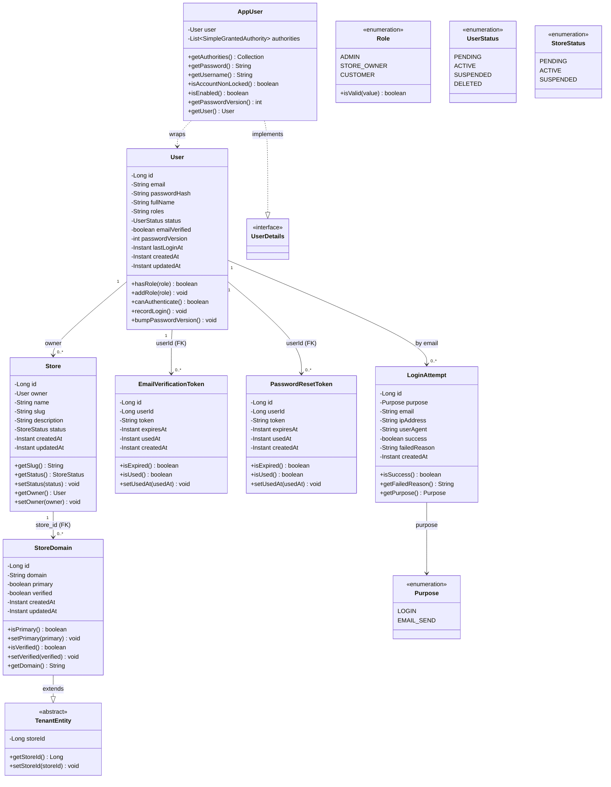

# MeethybridHub — Class Diagram (Domain Model)

> Viewable natively on GitHub. Editable draw.io version: [`01-class-diagram.drawio`](../01-class-diagram.drawio)

```mermaid
classDiagram
    direction TB

    class User {
        -Long id
        -String email
        -String passwordHash
        -String fullName
        -String roles
        -UserStatus status
        -boolean emailVerified
        -int passwordVersion
        -Instant lastLoginAt
        -Instant createdAt
        -Instant updatedAt
        +hasRole(role) boolean
        +addRole(role) void
        +canAuthenticate() boolean
        +recordLogin() void
        +bumpPasswordVersion() void
    }

    class AppUser {
        -User user
        -List~SimpleGrantedAuthority~ authorities
        +getAuthorities() Collection
        +getPassword() String
        +getUsername() String
        +isAccountNonLocked() boolean
        +isEnabled() boolean
        +getPasswordVersion() int
        +getUser() User
    }

    class UserDetails {
        <<interface>>
    }

    class Role {
        <<enumeration>>
        ADMIN
        STORE_OWNER
        CUSTOMER
        +isValid(value) boolean
    }

    class UserStatus {
        <<enumeration>>
        PENDING
        ACTIVE
        SUSPENDED
        DELETED
    }

    class Store {
        -Long id
        -User owner
        -String name
        -String slug
        -String description
        -StoreStatus status
        -Instant createdAt
        -Instant updatedAt
        +getSlug() String
        +getStatus() StoreStatus
        +setStatus(status) void
        +getOwner() User
        +setOwner(owner) void
    }

    class StoreStatus {
        <<enumeration>>
        PENDING
        ACTIVE
        SUSPENDED
    }

    class TenantEntity {
        <<abstract>>
        -Long storeId
        +getStoreId() Long
        +setStoreId(storeId) void
    }

    class StoreDomain {
        -Long id
        -String domain
        -boolean primary
        -boolean verified
        -Instant createdAt
        -Instant updatedAt
        +isPrimary() boolean
        +setPrimary(primary) void
        +isVerified() boolean
        +setVerified(verified) void
        +getDomain() String
    }

    class EmailVerificationToken {
        -Long id
        -Long userId
        -String token
        -Instant expiresAt
        -Instant usedAt
        -Instant createdAt
        +isExpired() boolean
        +isUsed() boolean
        +setUsedAt(usedAt) void
    }

    class PasswordResetToken {
        -Long id
        -Long userId
        -String token
        -Instant expiresAt
        -Instant usedAt
        -Instant createdAt
        +isExpired() boolean
        +isUsed() boolean
        +setUsedAt(usedAt) void
    }

    class LoginAttempt {
        -Long id
        -Purpose purpose
        -String email
        -String ipAddress
        -String userAgent
        -boolean success
        -String failedReason
        -Instant createdAt
        +isSuccess() boolean
        +getFailedReason() String
        +getPurpose() Purpose
    }

    class Purpose {
        <<enumeration>>
        LOGIN
        EMAIL_SEND
    }

    AppUser ..|> UserDetails : implements
    AppUser ..> User : wraps
    User "1" --> "0..*" Store : owner
    Store "1" --> "0..*" StoreDomain : store_id (FK)
    StoreDomain --|> TenantEntity : extends
    User "1" --> "0..*" EmailVerificationToken : userId (FK)
    User "1" --> "0..*" PasswordResetToken : userId (FK)
    User "1" --> "0..*" LoginAttempt : by email
    LoginAttempt --> Purpose : purpose
```
