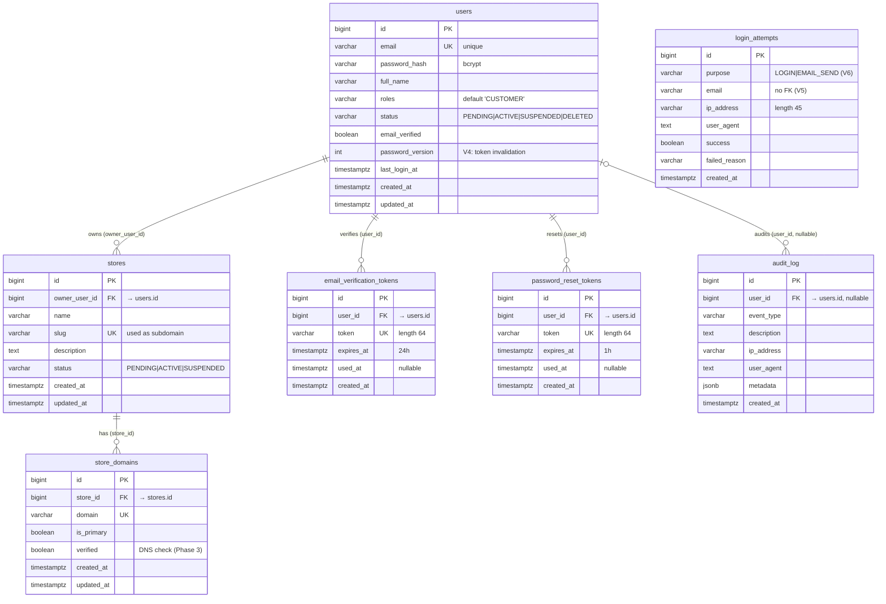

# MeethybridHub — ER Diagram (Database Schema)

> Viewable natively on GitHub. Editable draw.io version: [`02-er-diagram.drawio`](../02-er-diagram.drawio)

```mermaid
erDiagram
    users ||--o{ stores : "owns (owner_user_id)"
    stores ||--o{ store_domains : "has (store_id)"
    users ||--o{ email_verification_tokens : "verifies (user_id)"
    users ||--o{ password_reset_tokens : "resets (user_id)"
    users |o--o{ audit_log : "audits (user_id, nullable)"

    users {
        bigint id PK
        varchar email UK "unique"
        varchar password_hash "bcrypt"
        varchar full_name
        varchar roles "default 'CUSTOMER'"
        varchar status "PENDING|ACTIVE|SUSPENDED|DELETED"
        boolean email_verified
        int password_version "V4: token invalidation"
        timestamptz last_login_at
        timestamptz created_at
        timestamptz updated_at
    }

    stores {
        bigint id PK
        bigint owner_user_id FK "→ users.id"
        varchar name
        varchar slug UK "used as subdomain"
        text description
        varchar status "PENDING|ACTIVE|SUSPENDED"
        timestamptz created_at
        timestamptz updated_at
    }

    store_domains {
        bigint id PK
        bigint store_id FK "→ stores.id"
        varchar domain UK
        boolean is_primary
        boolean verified "DNS check (Phase 3)"
        timestamptz created_at
        timestamptz updated_at
    }

    email_verification_tokens {
        bigint id PK
        bigint user_id FK "→ users.id"
        varchar token UK "length 64"
        timestamptz expires_at "24h"
        timestamptz used_at "nullable"
        timestamptz created_at
    }

    password_reset_tokens {
        bigint id PK
        bigint user_id FK "→ users.id"
        varchar token UK "length 64"
        timestamptz expires_at "1h"
        timestamptz used_at "nullable"
        timestamptz created_at
    }

    login_attempts {
        bigint id PK
        varchar purpose "LOGIN|EMAIL_SEND (V6)"
        varchar email "no FK (V5)"
        varchar ip_address "length 45"
        text user_agent
        boolean success
        varchar failed_reason
        timestamptz created_at
    }

    audit_log {
        bigint id PK
        bigint user_id FK "→ users.id, nullable"
        varchar event_type
        text description
        varchar ip_address
        text user_agent
        jsonb metadata
        timestamptz created_at
    }
```
