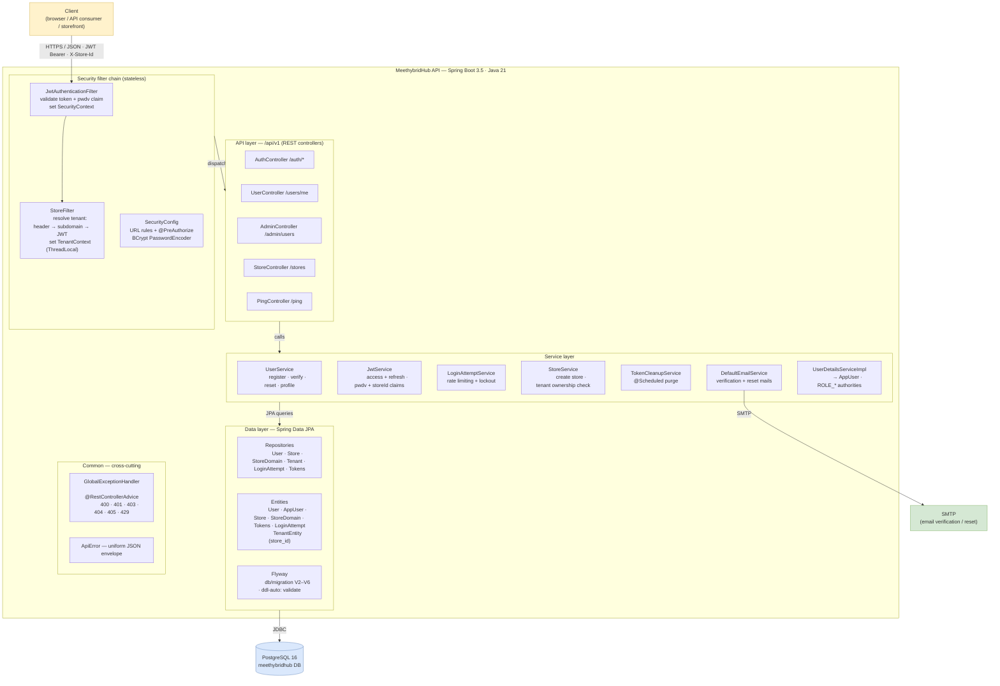

# MeethybridHub — Component Architecture

> Viewable natively on GitHub. Editable draw.io version: [`03-component-diagram.drawio`](../03-component-diagram.drawio)

```mermaid
flowchart TB
    Client["Client
    (browser / API consumer / storefront)"]:::client

    subgraph App["MeethybridHub API — Spring Boot 3.5 · Java 21"]
        subgraph Filters["Security filter chain (stateless)"]
            JWT["JwtAuthenticationFilter
            validate token + pwdv claim
            set SecurityContext"]
            SF["StoreFilter
            resolve tenant: header → subdomain → JWT
            set TenantContext (ThreadLocal)"]
            SC["SecurityConfig
            URL rules + @PreAuthorize
            BCrypt PasswordEncoder"]
        end

        subgraph API["API layer — /api/v1 (REST controllers)"]
            AuthCtl["AuthController /auth/*"]
            UserCtl["UserController /users/me"]
            AdminCtl["AdminController /admin/users"]
            StoreCtl["StoreController /stores"]
            PingCtl["PingController /ping"]
        end

        subgraph Services["Service layer"]
            UserSvc["UserService
            register · verify · reset · profile"]
            JwtSvc["JwtService
            access + refresh · pwdv + storeId claims"]
            LoginSvc["LoginAttemptService
            rate limiting + lockout"]
            StoreSvc["StoreService
            create store · tenant ownership check"]
            TokenSvc["TokenCleanupService
            @Scheduled purge"]
            MailSvc["DefaultEmailService
            verification + reset mails"]
            UDS["UserDetailsServiceImpl
            → AppUser · ROLE_* authorities"]
        end

        subgraph Data["Data layer — Spring Data JPA"]
            Repos["Repositories
            User · Store · StoreDomain · Tenant · LoginAttempt · Tokens"]
            Entities["Entities
            User · AppUser · Store · StoreDomain · Tokens · LoginAttempt
            TenantEntity (store_id)"]
            Flyway["Flyway
            db/migration V2–V6 · ddl-auto: validate"]
        end

        subgraph Common["Common — cross-cutting"]
            Err["GlobalExceptionHandler
            @RestControllerAdvice
            400 · 401 · 403 · 404 · 405 · 429"]
            ApiErr["ApiError — uniform JSON envelope"]
        end
    end

    PG[("PostgreSQL 16
    meethybridhub DB")]:::db
    SMTP["SMTP
    (email verification / reset)"]:::ext

    Client -->|"HTTPS / JSON · JWT Bearer · X-Store-Id"| JWT
    JWT --> SF
    Filters -->|dispatches| API
    API -->|calls| Services
    Services -->|JPA queries| Data
    Data -->|JDBC| PG
    MailSvc -->|SMTP| SMTP

    classDef client fill:#fff2cc,stroke:#d6b656
    classDef db fill:#dae8fc,stroke:#6c8ebf
    classDef ext fill:#d5e8d4,stroke:#82b366
```
