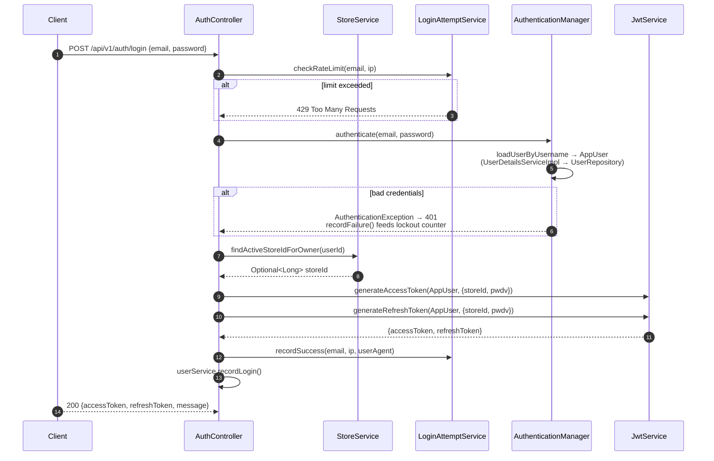

# MeethybridHub — Login Flow (POST /api/v1/auth/login)

> Viewable natively on GitHub. Editable draw.io version: [`04-sequence-login.drawio`](../04-sequence-login.drawio)

```mermaid
sequenceDiagram
    autonumber
    participant C as Client
    participant AC as AuthController
    participant SS as StoreService
    participant LS as LoginAttemptService
    participant AM as AuthenticationManager
    participant JS as JwtService

    C->>AC: POST /api/v1/auth/login {email, password}
    AC->>LS: checkRateLimit(email, ip)
    alt limit exceeded
        LS-->>AC: 429 Too Many Requests
    end
    AC->>AM: authenticate(email, password)
    AM->>AM: loadUserByUsername → AppUser<br/>(UserDetailsServiceImpl → UserRepository)
    alt bad credentials
        AM-->>AC: AuthenticationException → 401<br/>recordFailure() feeds lockout counter
    end
    AC->>SS: findActiveStoreIdForOwner(userId)
    SS-->>AC: Optional<Long> storeId
    AC->>JS: generateAccessToken(AppUser, {storeId, pwdv})
    AC->>JS: generateRefreshToken(AppUser, {storeId, pwdv})
    JS-->>AC: {accessToken, refreshToken}
    AC->>LS: recordSuccess(email, ip, userAgent)
    AC->>AC: userService.recordLogin()
    C-->>AC: 200 {accessToken, refreshToken, message}
```
