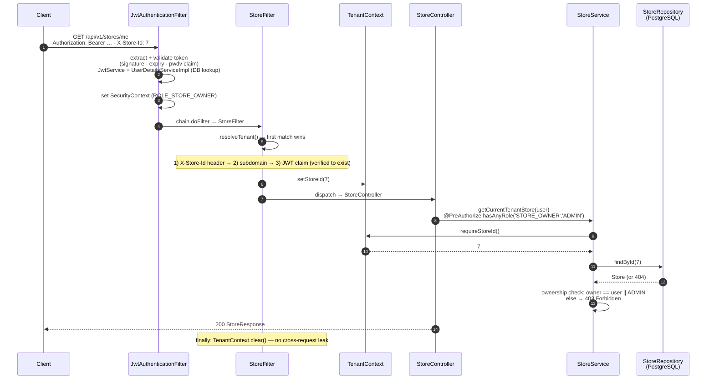

# MeethybridHub — Authenticated Request Lifecycle (tenant resolution)

> Viewable natively on GitHub. Editable draw.io version: [`05-sequence-request.drawio`](../05-sequence-request.drawio)

```mermaid
sequenceDiagram
    autonumber
    participant C as Client
    participant JF as JwtAuthenticationFilter
    participant SF as StoreFilter
    participant TC as TenantContext
    participant CO as StoreController
    participant SS as StoreService
    participant DB as StoreRepository<br/>(PostgreSQL)

    C->>JF: GET /api/v1/stores/me<br/>Authorization: Bearer … · X-Store-Id: 7
    JF->>JF: extract + validate token<br/>(signature · expiry · pwdv claim)<br/>JwtService + UserDetailsServiceImpl (DB lookup)
    JF->>JF: set SecurityContext (ROLE_STORE_OWNER)
    JF->>SF: chain.doFilter → StoreFilter
    SF->>SF: resolveTenant() — first match wins
    Note over SF: 1) X-Store-Id header → 2) subdomain → 3) JWT claim (verified to exist)
    SF->>TC: setStoreId(7)
    SF->>CO: dispatch → StoreController
    CO->>SS: getCurrentTenantStore(user)<br/>@PreAuthorize hasAnyRole('STORE_OWNER','ADMIN')
    SS->>TC: requireStoreId()
    TC-->>SS: 7
    SS->>DB: findById(7)
    DB-->>SS: Store (or 404)
    SS->>SS: ownership check: owner == user || ADMIN<br/>else → 403 Forbidden
    CO-->>C: 200 StoreResponse
    Note over SF: finally: TenantContext.clear() — no cross-request leak
```
