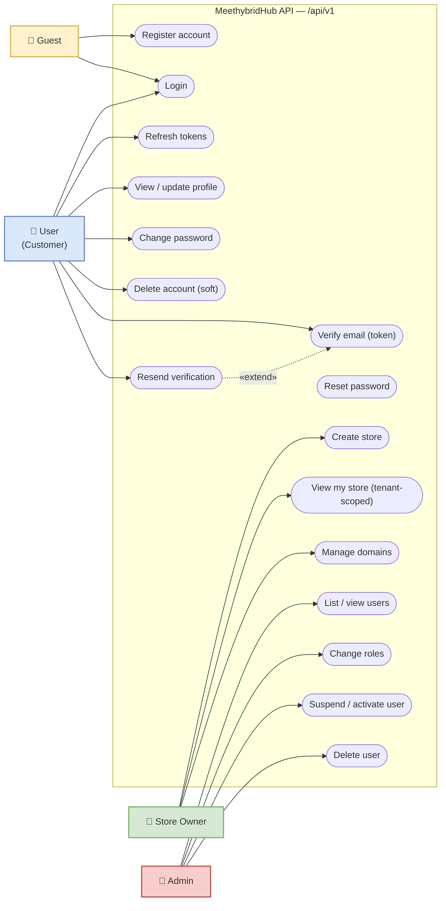

# MeethybridHub — Use Cases

> Viewable natively on GitHub. Editable draw.io version: [`06-use-case-diagram.drawio`](../06-use-case-diagram.drawio)
>
> Mermaid has no native use-case shape, so this is drawn as a flowchart with the same semantics: actors on the left, use cases inside the system boundary.

